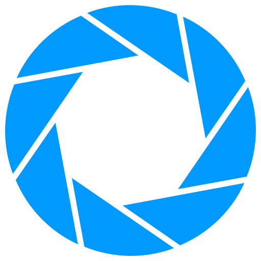

#  Welcome to the Aperture Science GitHub Testing Initiative!  

  

  <i>"We do what we must because we can." - GLaDOS</i>

## 💼 Current Role:
📊 **AI/ML Engineer at Perfect Solutions**  
💡 Focus: **Designing, training, and deploying machine learning models for enterprise applications**  
🔍 Responsibilities:
- Building **PyTorch and TensorFlow models** for automation and AI-driven use cases.  
- Developing **data preprocessing pipelines** for multi-million-row datasets.  
- Supporting **end-to-end ML workflows**, from data to deployment. 

## 🚀 I'm Currently In The Process Of:
📖 **Learning:**  
- **JAX & Deep Learning** – Exploring **Flax, Haiku, Optax**  
- **Deep-ML** – Solving Machine Learning and Data Science problems  
- **MLOps & Deployment** – CI/CD pipelines for ML models  
- **Improving my LeetCode Problem-Solving skills** for interviews  

💡 **Working On:** 
- **RAG for Vintage Keyboards & Switches** – Building a retrieval-augmented generation system using FAISS & FastAPI to preserve knowledge from the now-defunct Deskthority Wiki  
- **Vintage Board Modernization** – Tinkering with classic keyboards by creating **custom keymaps from scratch** and adapting them for modern firmware (QMK/ZMK)  
- **Improving My GitHub Repos** – Making code more production-ready  
- **Building My Website** – Hosting my portfolio & projects  

# 💫 About Me:
🎓 **MS in Machine Learning**, Stevens Institute of Technology  
🖥️ **Artificial Intelligence Enthusiast**  
💡 Interests: **Computer Vision, NLP, Generative AI, MLOps, LLMs**  
🎮 Fan of the **Portal Series**  

## 🚀 Featured Projects:
## 🚀 Featured Projects:
🔹 **[Spotify Insights Lab](https://github.com/akshayatam/spotify-insights-lab)** – Full-stack ML dashboard analyzing 1.2M+ tracks, with XGBoost promotion model, Streamlit UI, and PostgreSQL query optimization (~150× faster).  
🔹 **[Helmet Detection with YOLOv5](https://github.com/akshayatam/helmetdetect-fiftyone)** – Custom YOLOv5 model trained from scratch on 5K images; evaluated with FiftyOne to debug predictions and performance.  

## 🤝 Open-Source Contributions:
Here’s my latest contribution:

**[QMK Firmware](https://github.com/qmk/qmk_firmware)** - ANSI Tsangan Layout for Ducky One 2 Mini  
  

## 🌐 Socials:
 
 
 

## 💻 Tech Stack:

### 📌 Programming Languages:
 
 
 
 

### 📌 Machine Learning & Data Science:
 
 
 
 
 
 
 
 

### 📌 Big Data:
 
 

### 📌 Cloud & DevOps:
 
 
 

### 📌 Tools & Platforms:
 
 
 
 

## 📊 GitHub Stats:
 
 

<!-- Proudly created with GPRM ( https://gprm.itsvg.in ) -->
