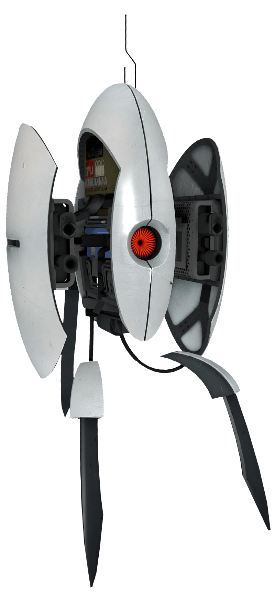
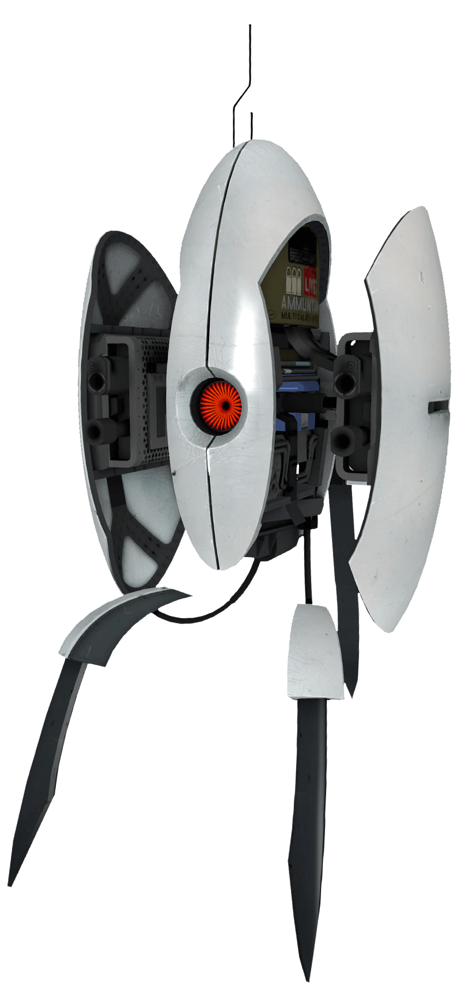

<h1 align="center">Hi 👋, I'm Akshay Atam</h1>
<h3 align="center">AI Engineer • Production ML • Agentic AI</h3>

  Building reliable ML systems, retrieval pipelines, and intelligent tools for real-world use.

  <a href="https://akshayatam.dev/">Portfolio</a> •
  <a href="mailto:akshay@akshayatam.dev">Email</a> •
  <a href="https://linkedin.com/in/akshay-atam">LinkedIn</a>

  

<table align="center">
  <tr>
    <td></td>
    <td align="center">
      <i>Building intelligent systems with curiosity, rigor, and a healthy respect for rogue AI.</i>
    </td>
    <td></td>
  </tr>
</table>

---

## 🧠 What I Do

I build **end-to-end machine learning systems**, from raw data to deployed intelligence.

- Design **scalable data pipelines** (ERP / CRM → ML-ready)
- Build and deploy **ML models in production environments**
- Develop **agentic AI + RAG systems** with real-world constraints
- Focus on **reliability, reproducibility, and performance**

---

## 💼 Experience

**AI Engineer @ Perfect Solutions Group Inc**  
- Built Python + SQL pipelines for enterprise datasets (↓ preprocessing time ~30%)  
- Automated training, evaluation, and deployment workflows (CI/CD)  
- Integrated forecasting + ML into production systems  

**Data Analyst @ Bright Mind Enrichment**  
- Consolidated multi-source data from 50+ teams into unified pipelines  
- Improved data quality for analytics and reporting  

---

## 🚀 Projects

### 🔹 Spotify Insights Lab  
Full-stack ML system on 1.2M+ tracks  
- XGBoost promotion prediction  
- PostgreSQL optimization (~150× faster queries)  
- Streamlit dashboard  

👉 https://github.com/akshayatam/spotify-insights-lab  

---

### 🔹 Vintage Keyboard RAG (Agentic AI)  
- Built RAG pipeline over domain-specific knowledge  
- FAISS + FastAPI + local LLMs  
- Exploring agent-based retrieval workflows  

---

### 🔹 Helmet Detection (YOLOv5)  
- Trained custom model on 5K images  
- Evaluated using FiftyOne for debugging + insights  

---

## 🛠️ Core Capabilities

What I focus on in practice:

- **Machine Learning Systems**: Training, evaluation, deployment  
- **Generative AI / RAG**: Retrieval pipelines, embeddings, agent workflows  
- **Data Engineering**: ETL pipelines, large-scale preprocessing  
- **MLOps**: CI/CD, reproducibility, model monitoring  
- **Backend for ML**: FastAPI, model serving  

---

## ⚙️ Tech I Use

  

---

## 🧪 Currently Exploring

- Rust for systems-level thinking in ML workflows  
- Agentic AI architectures (LangGraph-style systems)  
- Quant + finance-driven ML systems  

---

## 🌱 Open Source

Contributing features, bug fixes, security improvements, and tooling
across Rust, Python, Kotlin, and open-source developer ecosystems.

### [baseRT](https://github.com/basecompute/baseRT)
**`feat(cli): add rm model command`** · [PR #60](https://github.com/basecompute/baseRT/pull/60)

Implemented `basert rm <model>` for safely removing locally installed models,
including end-to-end tests, symlink protection, custom cache handling, and documentation.

---

### [Seal](https://github.com/JunkFood02/Seal)
**`fix: update youtubedl-android for QuickJS support`** · [PR #2659](https://github.com/JunkFood02/Seal/pull/2659)

Updated the yt-dlp Android dependency to restore YouTube downloads by enabling
the JavaScript runtime required by current yt-dlp versions.

---

### [folder-icons](https://github.com/sameerasw/folder-icons)
**`Add Notepad++ icon`** · [PR #57](https://github.com/sameerasw/folder-icons/pull/57)

Added matching PNG and ICO Notepad++ folder icons to the Windows 11 icon collection.

---

### [LangChain](https://github.com/langchain-ai/langchain)
**`fix(core): prevent symlink path escape in prompt loaders`** · [PR #36860](https://github.com/langchain-ai/langchain/pull/36860)

Implemented resolved-path validation and regression tests for symlink-based
path escapes. Closed because an equivalent fix was already being contributed.

---

### [QMK Firmware](https://github.com/qmk/qmk_firmware)
**Ducky One2 Mini ANSI Tsangan Layout** · [PR #24909](https://github.com/qmk/qmk_firmware/pull/24909)

Added ANSI Tsangan layout support for the Ducky One2 Mini, including a new keymap and updated keyboard layout configuration.

---

## 🌐 Connect With Me

  <a href="https://linkedin.com/in/akshay-atam">LinkedIn</a> •
  <a href="https://medium.com/@insanely_a_">Medium</a> •
  <a href="https://twitter.com/insanely_a_">Twitter</a>

---

  Always remember — <i>she's watching.</i> 
  <i>"We do what we must because we can." — GLaDOS</i>

